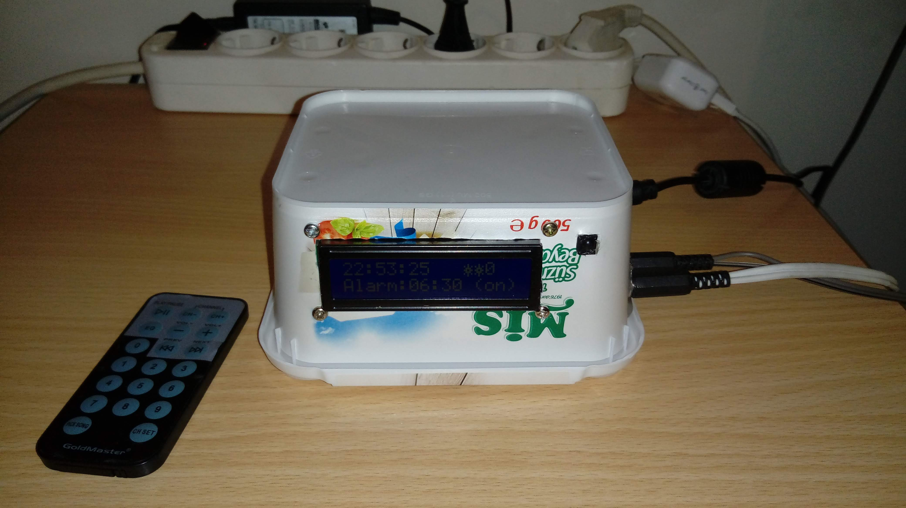
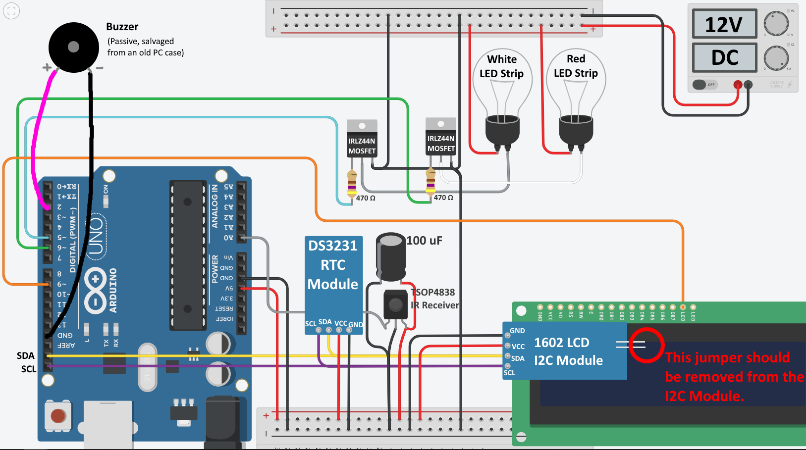
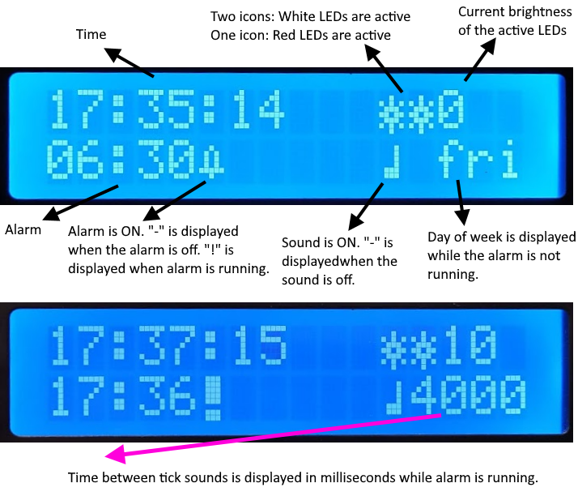
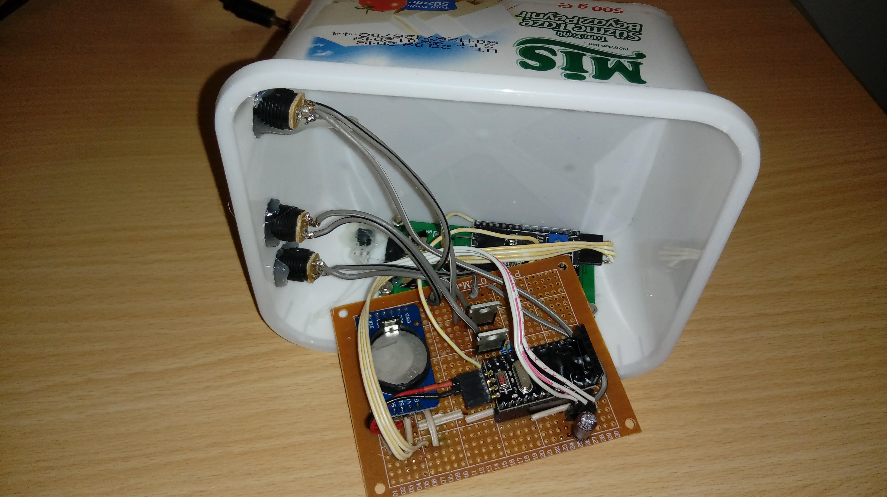
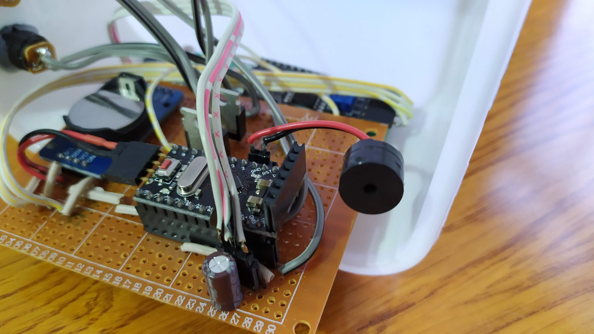
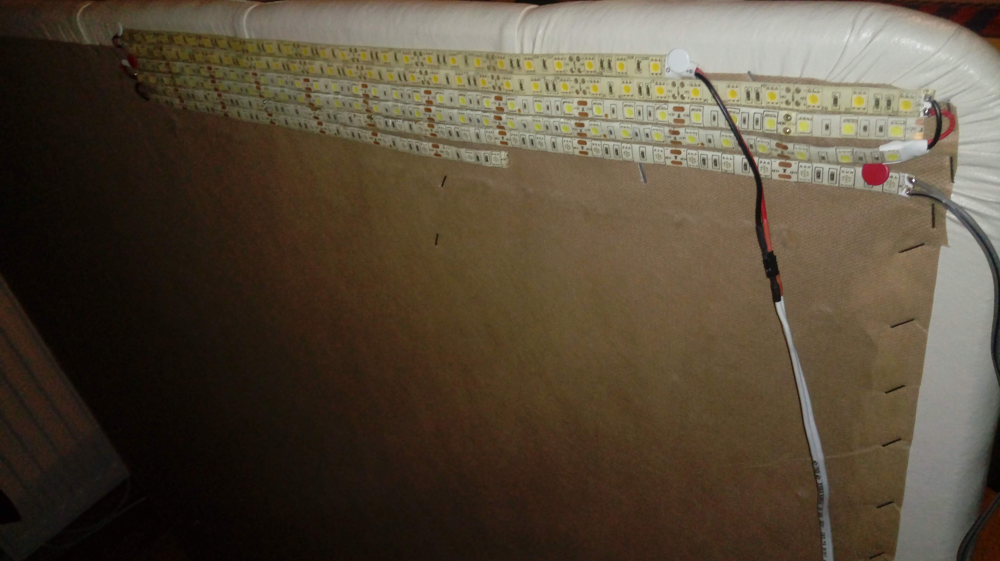
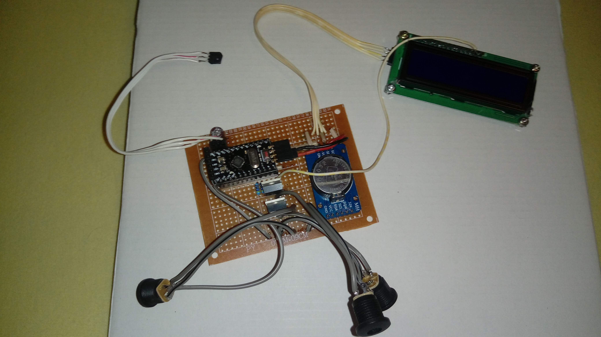
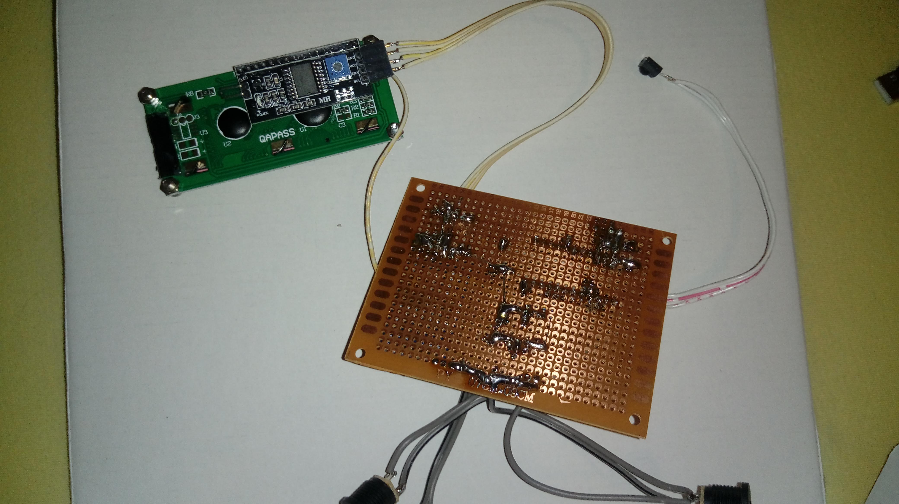

# Arduino Wake Up Light

An alarm clock which turns on the lights very slowly. Lights can be controlled manually with an IR remote. White LED strip is for the alarm, Red LED strip is for soft light to use in the evening. It also has a buzzer, which is used to making gentle "tick" sounds when the light reaches full brightness(after 30 minutes). The tick frequency starts at one tick every two seconds, it doubles its speed after every ten minutes. The sound can be turned off.

# Step 1: Build the circuit

# Step 2: Set the time

Before uploading the sketch to your Arduino, change the arguments of the setDS3231time method call(in the setup method) with the current values for the time and date and uncomment the method call. Upload the sketch. Comment out the method call and upload again. The time won't be lost unless you remove the battery from the DS3231 RTC module.

# Step 3: Set the remote

Go to line 129. There you will find what happens for which remote button. Those values most likely won't work with the remote that you are using. Watch this video and you'll learn how to setup your remote: https://youtu.be/ftdJ0R_5NZk

# Step 4: Using the device

When the alarm is active, brightness of the lights will increase 1 unit every 7 seconds. Maximum brightness value is 255. Current brightness value is displayed on the top right of the LCD screen. It will take 30 minutes to reach full brightness and after the time stated in the alarmDuration variable(3 hours), the light will turn off. You can change alarm duration and speed by changing the values of alarmDuration variable and searching for the value 7000(I should have made it a variable). Pressing any button will deactivate the alarm.

You can buy all the parts on aliexpress.

# More Pictures

You can find the Fritzing Sketch file that I used to design the circuit on perfboard in this repository. File name is "Wake Up Light Perfboard.fzz". It is incomplete but it can be helpful. 
